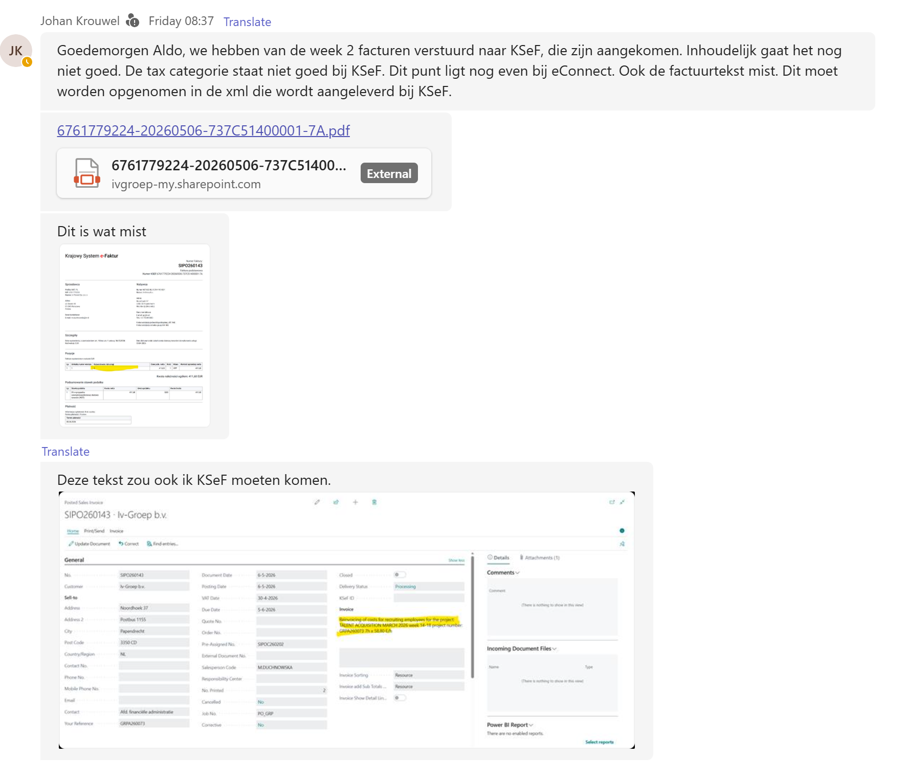
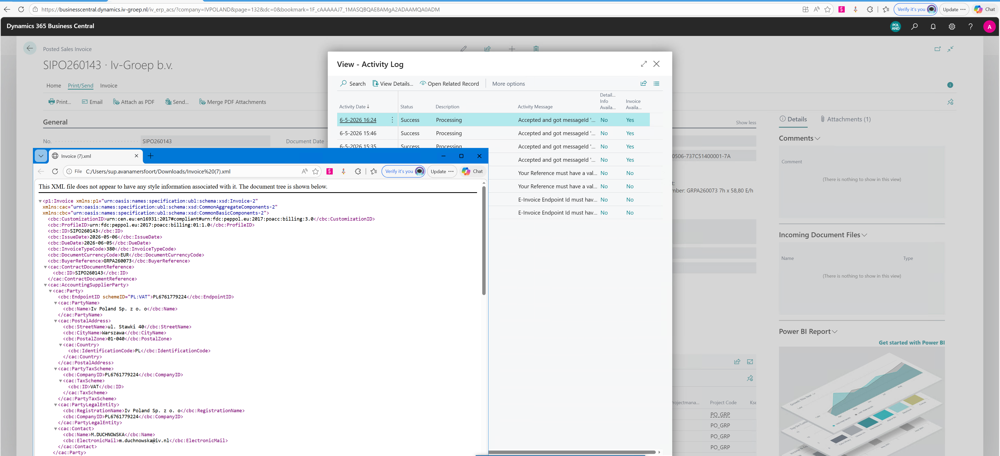
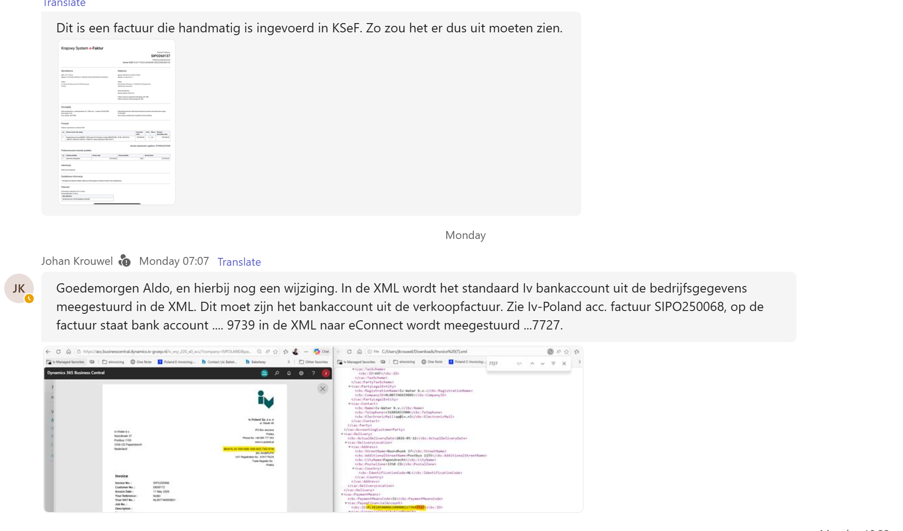
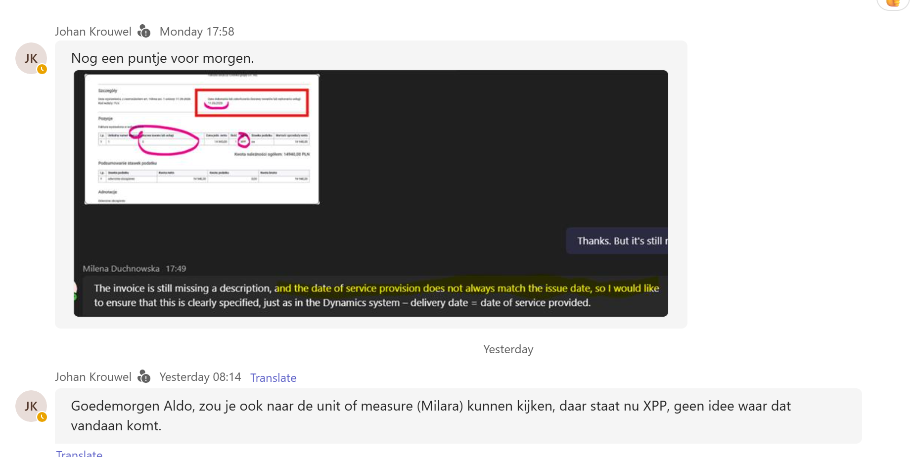

# KSeF Integration Issues

Reported by: Johan Krouwel / Milena Duchnowska (Iv-Poland)  
Date: May 2026

---

## 1. Missing invoice line description

**Severity:** High  
**Status:** Open  
**Affected invoices:** SIPO260143, and others

The item/service description (`Nazwa towaru lub usługi`) shows **"0"** in the KSeF invoice instead of the actual description from Business Central. For example, invoice SIPO260143 in BC contains:

> *"Reinvoicing of costs for recruiting employees for the project: TALENT ACQUISITION MARCH 2026 week 14-18 project number: GRPA260073 7h x 58,80 E/h"*

This text must be included in the XML delivered to KSeF. A manually entered KSeF invoice (SIPO260137) shows the description correctly, confirming the field is supported.

**KSeF invoice SIPO260143 — description shows "0":**

.png)

**BC Posted Sales Invoice SIPO260143 — actual description highlighted:**

.png)

**Reference: manually entered KSeF invoice SIPO260137 (correct):**

.png)

**Chat: Johan reporting missing invoice text + tax category:**



**BC Activity Log + XML for SIPO260143 — description missing in XML:**



### Assessment

The XMLport `PeppolBis3v0InvoicePSB` has two code paths for invoice lines:

1. **Detail mode** (`"Invoice Show Detail Lines" = true`): Uses `InvoiceLineLoop`, calls `PEPPOLMgt.GetLineItemInfo()` and then overrides `Description := SalesLine.Description`. This path should work correctly.
2. **No-detail mode** (`"Invoice Show Detail Lines" = false`): Uses `invoicelineloopnodetail`, which aggregates lines by VAT group. In this path the `NameNoDetail` field is set to `TempVATAmtLine."VAT Identifier"` — a VAT code like "0", not the line description.

The affected invoices use **no-detail mode**, which explains why "0" (the VAT Identifier) appears instead of the description.

### Decision

**Enable `"Invoice Show Detail Lines"` on the customer records for Iv-Poland.** This is a standard BC field on the Customer Card that gets copied to each new sales invoice at posting time. When set to `true`, the Peppol XML emits individual invoice lines with proper descriptions and unit codes — resolving both this issue and issue #4 (XPP) without code changes.

Action: Set `"Invoice Show Detail Lines" = true` on the relevant Iv-Poland customer cards. Existing posted invoices can be updated via "Update Document" on the Posted Sales Invoice page.

---

## 2. Wrong bank account in XML

**Severity:** High  
**Status:** Open  
**Affected invoices:** SIPO250068, and others

The XML sent to eConnect/KSeF contains the **default company bank account** from Company Information (IBAN ending ...7727) instead of the **bank account specified on the sales invoice** (IBAN ending ...9739).

- Invoice SIPO250068 in BC shows bank account: `PL 93 1050 0086 1000 0022 7362 9739`
- XML `<PayeeFinancialAccount><cbc:ID>` contains: `PL98105000861000002273607727`

The bank account must be sourced from the posted sales invoice, not from company information.

**BC invoice vs XML — bank account mismatch highlighted:**

.png)

**Chat: Johan reporting bank account issue:**



### Assessment

The bank account is populated in `PeppolBis3v0InvoicePSB.Xmlport.al` (~line 1244) via:

```al
PEPPOLMgt.GetPaymentMeansPayeeFinancialAccBIS(
    PayeeFinancialAccountID,
    FinancialInstitutionBranchID);
```

This is a **standard BC system codeunit** (`PEPPOL Management`) that reads the IBAN from `Company Information`, not from the posted sales invoice header. The sales invoice can have a different bank account assigned (e.g. via "Bank Account Code" on the invoice), but the standard procedure ignores it.

### Decision

**No per-company setting needed.** The fix uses simple precedence: if the invoice has a bank account assigned, use it; otherwise fall back to the company default. This is the objectively correct behavior — sending the wrong bank account is never desirable.

Override `PayeeFinancialAccountID` after the standard `GetPaymentMeansPayeeFinancialAccBIS()` call by reading `SalesHeader."Company Bank Account Code"` → `Bank Account.IBAN`. Applied to both Invoice and Credit Note XMLports.

---

## 3. Delivery date / date of service provision mismatch

**Severity:** Medium  
**Status:** Open

The date of service provision (`Data dokonania lub zakończenia dostawy towarów lub wykonania usługi`) does not always match the issue date. The customer requires this to be clearly specified:

> **delivery date = date of service provided** (as configured in Dynamics / Business Central)

The mapping should ensure the `ActualDeliveryDate` in the XML corresponds to the correct shipment/service date from BC, not default to the invoice issue date.

**Chat: Milena reporting date mismatch + missing description:**

.png)

**Chat: Johan + Milena discussing date of service provision and UoM:**



### Assessment

The delivery date is populated in `PeppolBis3v0InvoicePSB.Xmlport.al` (~line 1121) via:

```al
PEPPOLMgt.GetGLNDeliveryInfo(
    SalesHeader,
    ActualDeliveryDate,
    DeliveryID,
    DeliveryIDSchemeID);
```

This is a **standard BC system codeunit** (`PEPPOL Management`) that typically sets `ActualDeliveryDate` from `SalesHeader."Shipment Date"`. For KSeF/Poland the customer expects this to equal the **date of service provision**, which in BC maps to the `"Shipment Date"` or `"VAT Date"` on the invoice — not the `"Document Date"` / `"Posting Date"`.

The mismatch occurs when `Shipment Date` defaults to the posting date but the actual service date is different.

### Decision

**No code change needed — data entry / process fix.** The standard `PEPPOLMgt.GetGLNDeliveryInfo()` already reads `SalesHeader."Shipment Date"` as the `ActualDeliveryDate`, which is the correct BC field for "date of service provision."

The mismatch occurs because Iv-Poland is not setting `"Shipment Date"` correctly on their sales invoices before posting. When left blank or defaulted, it falls back to the posting date.

Action: Instruct Iv-Poland to ensure `"Shipment Date"` on sales invoices is set to the actual date of service provision before posting.

---

## 4. Incorrect unit of measure (XPP)

**Severity:** Medium  
**Status:** Open  
**Affected invoices:** SIPO260143

The unit of measure (`Miara`) shows **"XPP"** in KSeF, which is not a recognized/expected value. Origin of this value is unknown. The manually entered reference invoice (SIPO260137) shows **"szt."** (pieces) as the correct unit.

Investigate where "XPP" is sourced from and ensure the correct UoM code is mapped in the XML.

**KSeF invoice SIPO260143 — UoM shows "XPP":**

.png)

**Reference: KSeF invoice SIPO260137 — UoM shows "szt." (correct):**

.png)

### Assessment

"XPP" is a **hardcoded fallback** in the no-detail code path of `PeppolBis3v0InvoicePSB.Xmlport.al` (~line 2237):

```al
UnitCodeTxt: Label 'XPP', Locked = true;
unitCodeNoDetail := UnitCodeTxt;
```

When `"Invoice Show Detail Lines" = false`, the XMLport aggregates lines by VAT group and always sets the unit code to `'XPP'` (UN/ECE Rec 20 code for "piece" — but non-standard/uncommon). This is directly related to issue #1: the same no-detail code path causes both the missing description and the wrong UoM.

In the **detail code path**, the correct logic in `XmlPortsHelpersPSB.GetLineUnitCodeInfo()` reads `Unit of Measure."International Standard Code"` from the sales line's UoM — which would produce the correct code (e.g. `EA`, `H87`, `C62`).

### Decision

**Resolved by issue #1 decision.** Enabling `"Invoice Show Detail Lines"` on the Iv-Poland customer cards switches to the detail code path, which already reads the correct `"International Standard Code"` from the `Unit of Measure` table via `GetLineUnitCodeInfo()`.

Additionally: verify that the `Unit of Measure` records used by Iv-Poland have the correct `"International Standard Code"` set (e.g. `C62` for pieces, `EA` for each, `HUR` for hours).

---

## 5. Incorrect tax category in KSeF

**Severity:** High  
**Status:** Open (with eConnect)

The tax category is not rendered correctly in KSeF. This issue has been flagged as residing on the eConnect side. The tax category mapping in the XML needs to be reviewed and corrected.

**Chat: Johan reporting tax category issue:**


---

## 6. Merge forked-from 1.0.6.27 → 1.0.6.29 into OnPrem

**Severity:** High  
**Status:** Open  
**Plan:** [1.0.6.27-1.0.6.29--forked-from-merge-plan-to-22.0.7.0-onprem.md](../1.0.6.27-1.0.6.29--forked-from-merge-plan-to-22.0.7.0-onprem.md)

Merge 19 items from the upstream eConnect release into our OnPrem fork. Key features: Responsibility Center support for multi-entity supplier party data, customer-specific report selections, attachment handling improvements, KSeF clearance statuses, and a Bill-to validation bug fix.

### Assessment

- **4 phases**, no circular dependencies. Plan includes exact AL code snippets per item.
- **No conflict with our customizations.** The supplier party rewrite (Items 8–9) only touches code that is identical to the forked-from baseline. Our customizations (config-driven AdditionalDocumentReference CASE, SetupPSB, DocumentAttachment filtering) sit in separate code blocks.
- **Two minor merge points** in `Initialize()` and `AdditionalDocRefLoop` where our additions must be preserved alongside the new code.

### Risk

| Risk | Level | Mitigation |
|------|-------|------------|
| XmlPort supplier party rewrite (17 refs) | High (compile-time) | Plan has exact code; no overlap with our customizations |
| Sell-to → Bill-to validation fix | High (behavioral) | Correct behavior; verify Bill-to customer Peppol config |
| InitValue true→false on UseForPeppolPSB | Medium | Document in release notes |
| OnBeforeSend event signature change | Low | InternalEvent, no external subscribers detected |

### Decision

Proceed with implementation following the phased execution order in the merge plan. Our customizations (AdditionalDocument CASE, SetupPSB, DocumentAttachment init) will be preserved during the merge.

---

## Summary

| # | Issue | Severity | Owner |
|---|-------|----------|-------|
| 1 | Missing invoice line description | High | Dev |
| 2 | Wrong bank account in XML | High | Dev |
| 3 | Delivery date mismatch | Medium | Dev |
| 4 | Unknown unit of measure "XPP" | Medium | Dev |
| 5 | Incorrect tax category | High | eConnect |
| 6 | Merge forked-from 1.0.6.27 → 1.0.6.29 | High | Dev |
