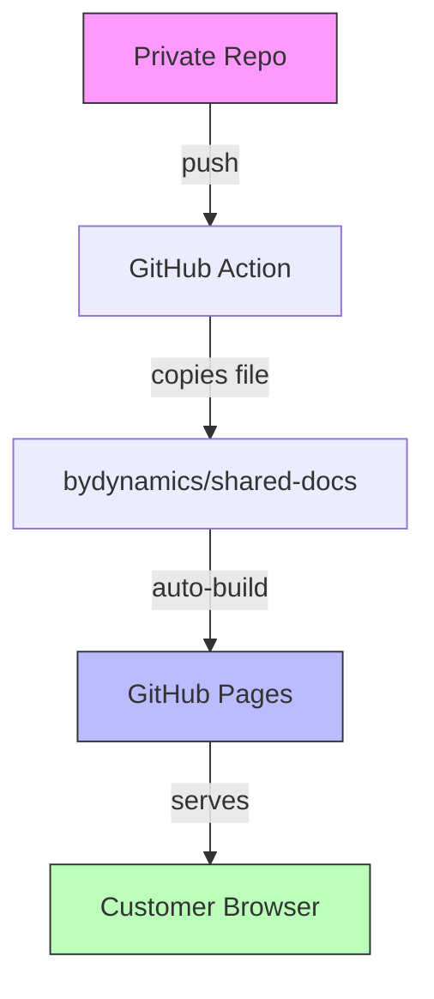
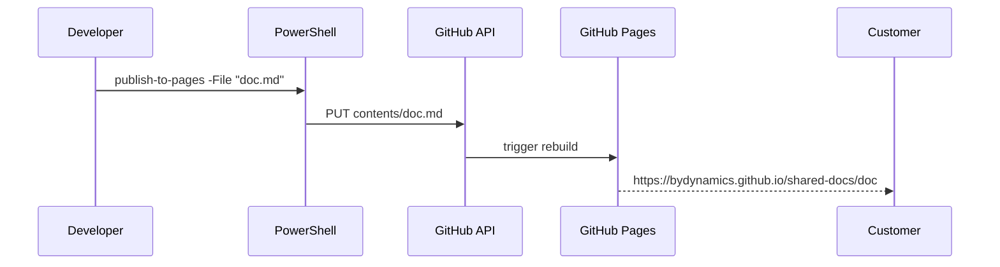

# Share Test File

This is a proof-of-concept file to verify that GitHub Pages renders markdown correctly — including diagrams and images.

## Architecture Overview

## Process Flow

## Sample Image

> This is a random image from Lorem Picsum to test image embedding on Pages.

## Conclusion

If you can see this page rendered with the Mermaid diagrams and the image above, the publish-to-pages pipeline is working correctly.
